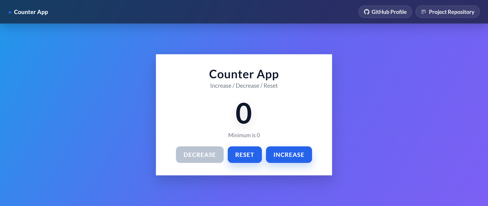

# Counter App ✅

A simple and modern counter app that lets you increase, decrease, or reset a number.  
It includes a clean UI, smooth animations, and prevents the counter from going below 0.

## 📸 Preview

## 🚀 Live Demo

👉 https://WarunaSLFI.github.io/JavaScript-Counter-Program/

> Replace `REPO_NAME` with your real GitHub repository name after you enable GitHub Pages.

## 🛠 Built With

- HTML
- CSS
- JavaScript

## 📚 What I Learned

- How to update the DOM using JavaScript
- How to handle button clicks using `addEventListener`
- How to prevent invalid values (example: not going below 0)
- How to add smooth UI animations using CSS
- How to structure a small project neatly for GitHub
